# Step 1 To Step 7 Architecture Evolution
* **step-1-to-7-architecture-evolution.md**:
Shows what is added at each section of the current root README, from environment setup through Terraform inspection.

```mermaid
flowchart TB
    classDef state fill:#f8f8f8,stroke:#555,color:#111,stroke-width:1px;
    classDef added fill:#e8f5e9,stroke:#2e7d32,color:#102510,stroke-width:1px;
    classDef data fill:#eaf3ff,stroke:#2c5d9b,color:#102234,stroke-width:1px;
    classDef runtime fill:#fff4e8,stroke:#b66a2c,color:#341b08,stroke-width:1px;

    step1[After Section 1\nPython environments exist\n- main .venv\n- isolated .venv-flink\n- pinned PyFlink toolchain]:::state

    step2[After Section 2\nSource artifacts exist\n- raw day-ahead CSV files\n- normalized canonical CSV\n- replayable input set]:::added

    step3[After Section 3\nStreaming runtime and sink exist\n- Redpanda + PostgreSQL + Flink running\n- topic holds replayed events\n- stream_hourly_lmp populated]:::added

    step4[After Section 4\nRaw landing layer exists\n- local PostgreSQL raw table\n- BigQuery raw table\n- same source validated in both targets]:::added

    step5[After Section 5\nWarehouse model layer exists\n- typed staging model\n- hourly mart\n- daily mart\n- dbt tests and warehouse validation]:::added

    step6[After Section 6\nPresentation layer exists\n- Streamlit app queries marts\n- dashboard tiles render from modeled warehouse tables]:::added

    step7[After Section 7\nInfrastructure slice is documented and validated\n- Terraform config read\n- terraform init -backend=false\n- terraform validate success]:::added

    env_ready[Persistent environment state\nPython runtimes and package sets]:::data
    source_ready[Persistent source artifacts\nraw + normalized files]:::data
    runtime_ready[Persistent local runtime\nCompose services + topic + sink state]:::runtime
    warehouse_ready[Persistent warehouse state\nraw + staging + marts]:::data
    infra_ready[Persistent IaC assets\nTerraform files in repo]:::data

    step1 -->|adds source files| step2
    step2 -->|adds runtime and stream output| step3
    step3 -->|adds raw warehouse targets| step4
    step4 -->|adds dbt models and tests| step5
    step5 -->|adds dashboard layer| step6
    step6 -->|adds infrastructure validation| step7

    step1 -.produces.-> env_ready
    step2 -.produces.-> source_ready
    step3 -.produces.-> runtime_ready
    step5 -.produces.-> warehouse_ready
    step7 -.confirms.-> infra_ready

    env_ready --> step2
    source_ready --> step3
    runtime_ready --> step4
    warehouse_ready --> step6
    infra_ready --> step7
```

