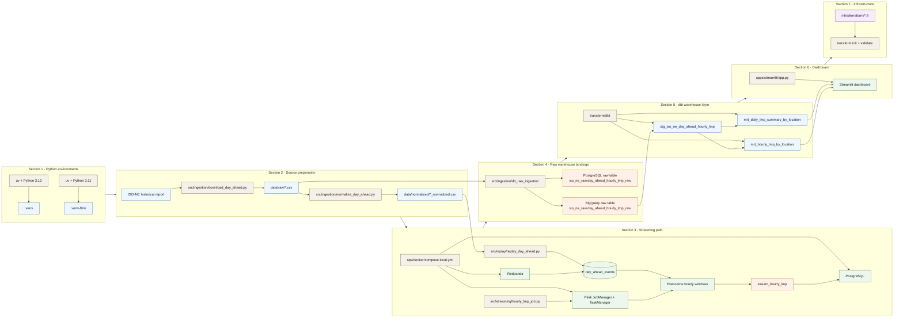

# Step 1 To Step 7 Service Flow
* **step-1-to-7-service-flow.md**:
Shows the end-to-end service and artifact flow across the current root README sections, from environment creation to dashboard and Terraform validation.

